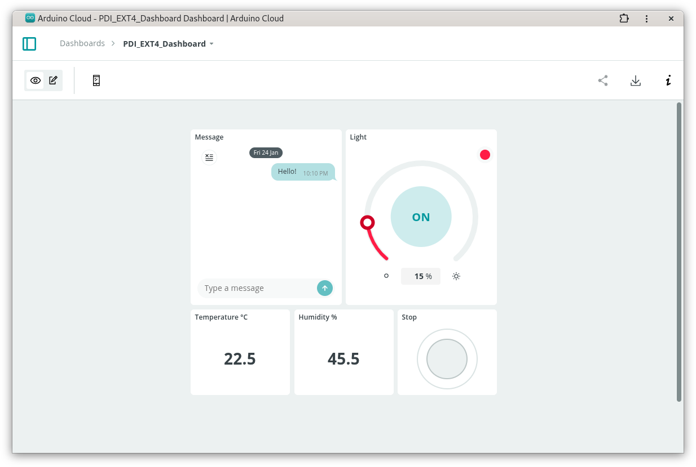

# PDI EXT4 Remote WiFi with Arduino Cloud 

The **PDI EXT4 Remote WiFi with Arduino Cloud** project is a home automation application that displays on an e-paper the temperature and humidity as well as messages received by Internet.

The project uses an Arduino Nano ESP32 and the Pervasive Displays EXT4 extension kit.



It connects to the Arduino cloud and dashboard. The dashboard displays the temperature and humidity, selects the colour of the RGB LED and sends messages.

The Pervasive Displays EXT4 extension kit is part of the EPDK-Matter bundle. The adapter board supports the other Arduino Nano boards operating at 3.3V.  

The project is developed with the Arduino IDE 2.3.3 with the Espressif ESP32 core. Select **Pin Numbering > By GPIO number (Legacy)** for compatibility with the Adafruit NeoPixel library.

## Details

The sketch was initially generated with the Arduino IoT Cloud Thing.

The variables used by the Arduino IoT Cloud are

Type | Variable | Widget | READ/WRITE
---- | ---- | ---- | ----
String | vText | Messenger | READ/WRITE
float | vHumidity | Value, float | READ
float | vTemperature | Value, float | READ
CloudColoredLight | vColour | Coloured light | READ/WRITE
bool | vStop | Button | READ/WRITE

Variables which are marked as `READ/WRITE` in the Cloud Thing will also have functions which are called when their values are changed from the Dashboard. 

These functions are generated with the Thing and added at the end of this sketch.

The file `thingProperties.h` was initially generated by the Arduino IoT Cloud but was edited as it contained a *secret* variable in plain text.

``` cpp
--- Edited
const char DEVICE_LOGIN_NAME[] = SECRET_DEVICE_LOGIN_NAME; // Device login name
--- End of Edited
```

The *secret* variable `SECRET_DEVICE_LOGIN_NAME` is moved to `arduino_secrets.h`.

## References

Hardware

* EPDK-Matter Development Kit https://www.pervasivedisplays.com/product/epdk-matter/
* Pervasive Displays EXT4 extension board https://www.pervasivedisplays.com/product/epd-extension-kit-gen-4-ext4/
* Pervasive Displays 2.90" HD 290-KS-0J https://www.pervasivedisplays.com/product/2-9-e-ink-displays/ 
* Arduino Nano ESP32 https://store.arduino.cc/products/nano-esp32  
* Texas Instruments HDC2080 2% RH ultra-low-power digital relative humidity sensor, interrupt/DRDY https://www.ti.com/product/HDC2080
* WorldSemi WS2813C http://www.world-semi.com/ws2813-family/273.html

Software 

* Pervasive Displays Library Suite for EXT4 https://github.com/rei-vilo/PDLS_EXT4_Basic_Matter 
* Weather Sensors Library https://github.com/rei-vilo/SensorsWeather_Library
* ESP32 core 3.0.7 https://github.com/espressif/arduino-esp32
* Adafruit NeoPixel library https://github.com/adafruit/Adafruit_NeoPixel

Service

* Arduino cloud and dashboard https://cloud.arduino.cc/

## Issues

### NeoPixel issue

When using **Pin Numbering > By Arduino pin (Default)**

```
~/Projets/Arduino/libraries/Adafruit_NeoPixel/esp.c:40: undefined reference to `digitalPinToGPIONumber'
~/.arduino15/packages/esp32/tools/esp-xs3/2302/bin/../lib/gcc/xtensa-esp32s3-elf/12.2.0/../../../../xtensa-esp32s3-elf/bin/ld: ~/Projets/Arduino/libraries/Adafruit_NeoPixel/esp.c:65: undefined reference to `digitalPinToGPIONumber'
collect2: error: ld returned 1 exit status
```

Use **Pin Numbering > By GPIO number (Legacy)** instead

```
-DARDUINO_FQBN="esp32:esp32:nano_nora:USBMode=default,PartitionScheme=default,PinNumbers=byGPIONumber" 
-DBOARD_HAS_PIN_REMAP 
```

### Upload error with Programmer = ESPtool

Upload often raises an error.

```
"~/.arduino15/packages/arduino/tools/dfu-util/0.11.0-arduino5/dfu-util" --device 0x2341:0x0070 -D "~/.var/app/cc.arduino.IDE2/cache/arduino/sketches/B74BAAA1CDC76BF1D661B8EA49CB0DA1/Blink.ino.bin" -Q
dfu-util 0.11-arduino4

Copyright 2005-2009 Weston Schmidt, Harald Welte and OpenMoko Inc.
Copyright 2010-2021 Tormod Volden and Stefan Schmidt
This program is Free Software and has ABSOLUTELY NO WARRANTY
Please report bugs to http://sourceforge.net/p/dfu-util/tickets/

dfu-util: Cannot open DFU device 2341:0070 found on devnum 95 (LIBUSB_ERROR_ACCESS)
dfu-util: No DFU capable USB device available
Failed uploading: uploading error: exit status 74
```

Follow the guidance from [Reset the Arduino bootloader on the Nano ESP32](https://support.arduino.cc/hc/en-us/articles/9810414060188-Reset-the-Arduino-bootloader-on-the-Nano-ESP32)


## Licence

**Copyright** &copy; Rei Vilo, 2010-2025

For exclusive use with Pervasive Displays screens

**Licence** [Attribution-NonCommercial-ShareAlike 4.0 International (CC BY-NC-SA 4.0)](./LICENCE.md)


